# Docker-CICD-Load-Balanced-App

**Part 1 of 2** | [Part 2: Azure-Native-CICD-Load-Balanced-App](https://github.com/Adewoleshittabey/Azure-Native-CICD-Load-Balanced-App)

A fully automated CI/CD pipeline that tests and deploys a Node.js web application to an Azure Virtual Machine, served through an Nginx load balancer with round-robin traffic distribution across two Docker containers — triggered automatically on every feature branch push to GitHub.

---

## Architecture



---

## How It Works

1. Developer pushes code to the `feature/ci-pipeline` branch
2. **GitHub Actions** triggers automatically on GitHub's servers
3. **Job 1 — Test:** runs `npm test`. Pipeline stops if tests fail
4. **Job 2 — Deploy:** copies files to the Azure VM via rsync, then runs `docker compose up --build`
5. **Docker Compose** starts three containers on the VM:
   - **Nginx** — load balancer on port 80, distributes traffic round-robin
   - **app1** — Node.js server on port 3000, hostname set to `app1`
   - **app2** — Node.js server on port 3000, hostname set to `app2`
6. Pipeline verifies the app responds via curl
```
curl http://20.208.25.215
Hi there! I'm being served from app1

curl http://20.208.25.215
Hi there! I'm being served from app2
```

---

## Live Application

**VM Public IP:** http://20.208.25.215 (when VM is running)

---

## Technology Stack

| Technology | Role |
|---|---|
| GitHub Actions | CI/CD pipeline — 2 jobs: test, deploy |
| Docker | Containerises the Node.js application |
| Docker Compose | Runs all three containers together on one VM |
| Nginx | Load balancer — receives traffic on port 80, distributes round-robin to app containers |
| Microsoft Azure | Cloud platform — provides the VM |
| Node.js | The web application runtime |
| Ubuntu 24.04 LTS | OS on the Azure VM |

---

## How It Differs from Part 2

| Component | Part 1 (This repo) | Part 2 (Azure-Native) |
|---|---|---|
| Load Balancer | Nginx software container | Azure Load Balancer (managed service) |
| App Servers | 2 containers on 1 VM | 2 separate Azure VMs |
| Image Registry | None — built on VM each time | Azure Container Registry |
| Provisioning | Docker Compose | Azure CLI (Infrastructure as Code) |
| Health Checking | Basic container restart | HTTP health probes every 15 seconds |

---

## Azure Resources

| Resource | Name | Value |
|---|---|---|
| Virtual Machine | vm-devops-server | 20.208.25.215 |
| Region | Switzerland North | vm-app1-devops.switzerlandnorth.cloudapp.azure.com |
| Resource Group | rg-devops-project | — |
| OS | Ubuntu Server 24.04 LTS | — |

---

## Pipeline Jobs

### Job 1: Test
Runs on a GitHub-hosted Ubuntu runner. Installs Node.js 18, runs `npm install` and `npm test`. If tests fail the pipeline stops — nothing is deployed.

### Job 2: Deploy
Copies all project files to the Azure VM using `rsync` over SSH. SSHs into the VM and runs `docker compose down` followed by `docker compose up -d --build`. This rebuilds the application image and starts all three containers fresh.

The `--hostname` flag in `docker-compose.yml` sets each container's hostname to `app1` or `app2`. The Node.js app reads `os.hostname()` at runtime — this is what makes each container return a different name in the response.

---

## GitHub Secrets Required

| Secret | Purpose |
|---|---|
| `VM_HOST` | Azure VM public IP for SSH and verification |
| `VM_USER` | SSH username (`azureuser`) |
| `VM_SSH_KEY` | VM private SSH key contents |

---

## Infrastructure Files

| File | Purpose |
|---|---|
| `Dockerfile` | Builds the Node.js application container image |
| `nginx/nginx.conf` | Nginx load balancer configuration — round-robin between app1 and app2 |
| `docker-compose.yml` | Defines all three containers and their connections |
| `.github/workflows/ci.yml` | GitHub Actions pipeline — triggers on feature branch push |

---

## Running the Application Locally
```bash
git clone https://github.com/Adewoleshittabey/Docker-CICD-Load-Balanced-App.git
cd Docker-CICD-Load-Balanced-App
npm install
npm test
npm start
# Visit http://localhost:3000
```

---

## Commit History
```
ff73f9f  fix: set explicit hostnames for app1 and app2 containers
8bb7e03  feat: add GitHub Actions CI/CD pipeline
d8b7247  feat: add docker-compose environment with load balancer and two app servers
8becfc6  feat: add nginx load balancer configuration
4156db8  feat: add Dockerfile, .gitignore and package-lock.json
```

---

## Author

Adewole Shitta Bey
